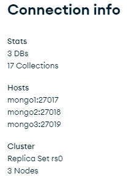
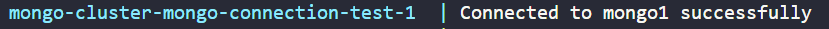
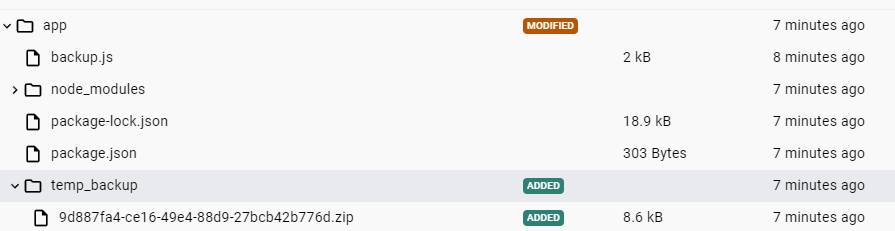

# mongo-replication

This example creates a mongo replication with 3 nodes (1 primary and 2 secondary).

> The setup_replicas.sh initiates the replicas.

> The schedule_backup.sh creates a cron job to run the backup-service everyday at midnight.

## Replication in mongodb

-  A replica set is a group of mongod instances that maintain the same data set. A replica set contains several data bearing nodes and optionally one arbiter node. Of the data bearing nodes, one and only one member is deemed the primary node, while the other nodes are deemed secondary nodes.

- The primary node receives all write operations. A replica set can have only one primary capable of confirming writes with { w: "majority" } write concern; although in some circumstances, another mongod instance may transiently believe itself to also be primary. [1] The primary records all changes to its data sets in its operation log, i.e. oplog. For more information on primary node operation, see Replica Set Primary.

- The secondaries replicate the primary’s oplog and apply the operations to their data sets such that the secondaries’ data sets reflect the primary’s data set. If the primary is unavailable, the replica set will elect a secondary to be primary. For more information on secondary members, see Replica Set Secondary Members.

> for more information read : https://www.mongodb.com/docs/v3.0/core/replication-introduction/

## Executing

> docker compose up mongo-setup --build -d

## Testing the connection ( connecting thru an application on containers)

> docker compose up mongo-connection-test --build

you should notice in the output: **"Connected to mongo1 successfully"**

## Running the backup service

> docker compose up backup-service --build -d

A new backup with a random uuid will be created on the app/temp_backup directory

